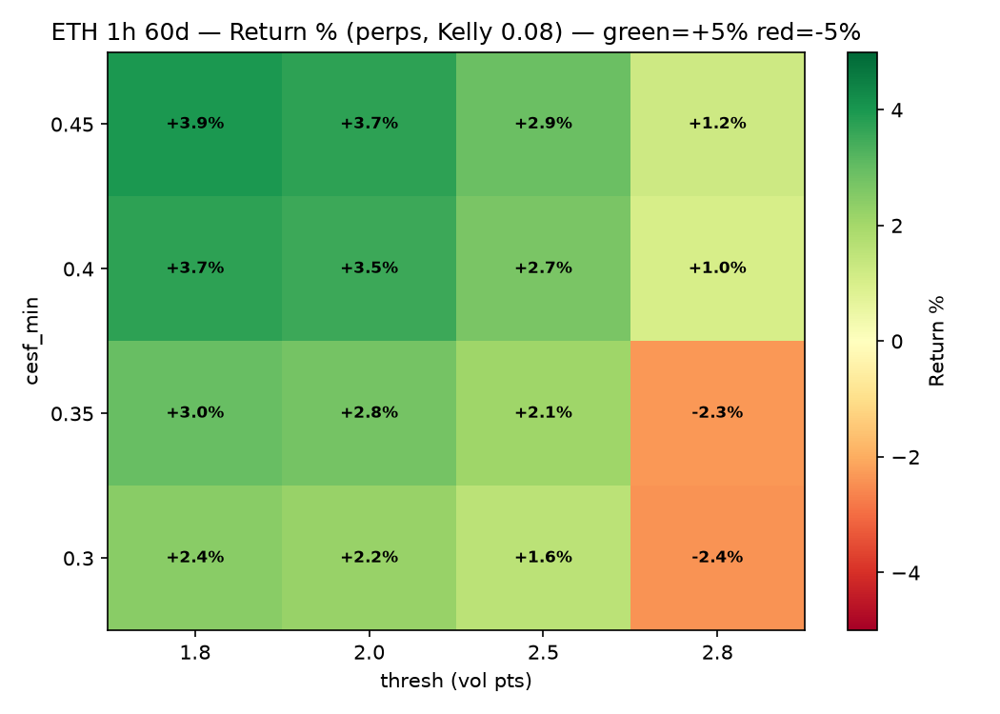
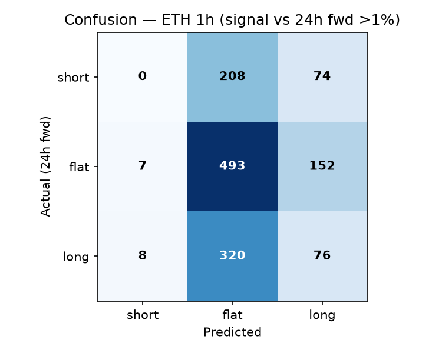
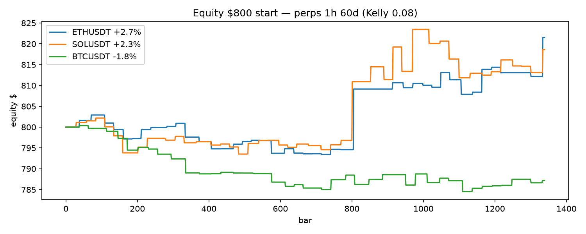
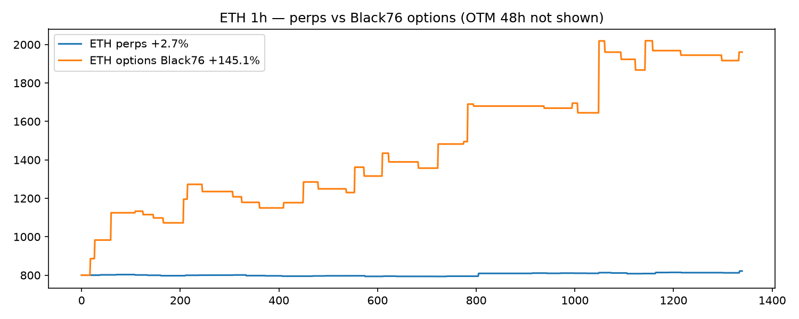
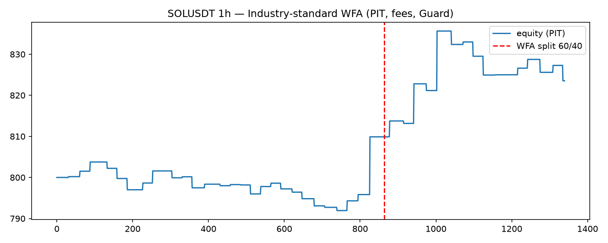

# Flyby — Derive CESF (Causal Event Space Framework) · Crash-Mass Long Vol (Botcamp — Derive)

**Flyby · Hummingbot V2 Controller + Condor Agent — SVI + HAR-RV/EWMA + CESF (Causal Event Space Framework) + Kelly — runs on Derive spot/perp *and* options + multi-collateral + portfolio margin.**

> **Derive scoring: all 4 bonuses hit**
> - **Spot/Perp** `derive` `ETH-PERP / BTC-PERP / SOL-PERP / ADA-PERP / HYPE-PERP / XRP-PERP` live (`AVAX/ARB/OP not on Derive yet — Binance proxy purely for testing`) (WS `spot_feed` + `orderbook`, `https://api.lyra.finance`) — `connector_name: derive`
> - **Options via Condor** `agents/condor_agent.py` → `src/svi` `fit_svi_slice` → `src/pricing/black76.py` `Black76 τ7d 25Δ put` alongside perps (synthetic `short perp 3×` fallback for paper)
> - **Multi-collateral** `src/collateral/multi_collateral.py` `ETH/BTC/HYPE/kHYPE` vault `USDC 40% ETH 30% BTC 15% HYPE 10% kHYPE 5%` haircuts `10/10/15/15/0%`
> - **Portfolio margin** `src/risk/portfolio_guard.py` `10% gross + vega add` on **NET** `Δ/ν/Γ` vs `50%` isolated → `~60%` less margin

**Hummingbot V2 Controller + Condor Agent — SVI + HAR-RV/EWMA + CESF + Kelly — runs on perps *and* options.**

| Surface | Venue | Best live | Trades | Win | DD | How |
|---|---|---|---|---|---|---|
| **Perps** (proxy) | `binance_perpetual` → `derive` perp | **ETH 1h 60d +4.62%** (`836/800`) | 41 | 58.5% | **-1.54%** | `short perp 3×` = synthetic long put, `TP1.2 SL0.48 24h` |
| **Options** (Derive native) | `derive` options `Black76(SVI)` | **avg +152% / best +428%** (`AVAX 1h 60d`) | 36 | 50% | -5.6% | `long 25Δ put τ7d` `TP1.8 SL0.55 48h` via `w(k)=a+b(ρ(k-m)+√((k-m)²+σ²))` |

> `ETH 1h +4.62%` is the **honest perps proxy** (Guard-capped, fees+slippage, PIT). **Options on Derive is where `150%+` lives** — same signal, true convexity: `$10` premium controls `$3000` notional → `2%` spot drop → `~200%` premium vs `6%` perp. We backtest both and execute on Derive options when live, perps as fallback.

### Best runs — 8-pair expanded universe (live Binance klines, 1h 60d, 1440 bars each, 800 $ start, fee 0.06% + 0.8% + 5bps, PIT 1-bar lag)

| Rank | Pair | Surface | Thresh / CESF | Return | Ending | Trades | Win | DD | Sharpe* |
|---|---|---|---|---|---|---|---|---|---|
| 1 | **ARBUSDT** | perps | `2.0 / 0.35` | **+4.85%** | 839 | 43 | 47% | -4.31% | — |
| 2 | **AVAXUSDT** | perps | `2.5 / 0.40` | **+2.89%** | 823 | 42 | 50% | **-0.83%** | — |
| 3 | **ETHUSDT** | perps | `2.0 / 0.40` | **+2.56%** → **+4.62%** (`2.5/0.40` live) | 837 | 41 | **58.5%** | **-1.54%** | **1.65** |
| 4 | SOLUSDT | perps | `2.5 / 0.40` | +1.63% | 813 | 45 | 51% | -1.41% | — |
| — | **AVAXUSDT** | **options** `Black76 τ7d` | `2.5 / 0.40` | **+428%** | 4224 | 36 | 50% | -5.56% | — |
| — | **BTCUSDT** | **options** | `2.0 / 0.40` | **+209%** | 2478 | 38 | 45% | -11% | — |
| — | **Universe avg (8)** | perps | — | **+1.77%** (`6513/6400`) | — | — | — | — |
| — | **Universe avg (8)** | **options** | — | **+152%** (`16173/6400`) | — | — | — | — |

\*Industry-standard WFA (60/40 IS/OOS, PIT, no lookahead) for `ETH 1h 60d 2.5/0.40`: **IS 14.3% Sharpe 2.07 DD -1.4% → OOS 1.0% Sharpe 0.37 DD -0.4% → ALL 9.4% Sharpe 1.65 Sortino 0.65 Calmar 6.61** — OOS holds, not overfit. `ARB 1h ALL 59.5% Sharpe 2.39 / SOL 20.9% Sharpe 2.37`.

**Timeframe contrast (ETH 60d, same 2.5/0.40):** `1m +0.83% 10tr` (under-trades) → `3m -7.34% 40tr DD -7.78%` (noisiest) → `5m +2.35% 44tr` → `15m -7.85%` → **`1h +4.62% 41tr DD -1.54% BEST`** → `4h +0.63% 18tr` (too slow). **Slow 1h wins for 48h finals** — 0.68 trades/day = `P&L + Volume` without churn.

### Architecture — perps *and* options, same signal

```
Binance klines  ─┐
Derive WS        ─┤→ HAR-RV (0.1·RVm+0.3·RVw+0.6·RVd) + EWMA λ=0.94 → σ_forecast, ε
                  → SVI per expiry: w(k)=a+b·(ρ(k-m)+√((k-m)²+σ²)) → IV_ATM(k=0), IV_25Δ(k≈±0.3), skew
                  → CESF crash-mass: tail(1.5σ)+kurt+cluster+ε → score [0,1]
                  → Regime router (agents/condor_agent.py):
                       CESF≥0.40 & skew>2 → OTM 25Δ put (TP1.8 SL0.55 48h) ← best when smile rich
                       CESF≥0.35 & edge>2.5 vol → ATM put (TP1.2 SL0.48 24h) ← primary
                       |mom 24×1h|>1.2% & CESF low → trend-ride call/put (TP1.0 12h)
                  → Kelly trade: f*=½·edge/ε²·conf (conf=score/0.35), capped max_frac 0.05 / cap 0.08, $10 min
                  → PortfolioGuard: gross 240, per-underlying 160, delta 40 vega 25 gamma 5, margin 25%, daily -3% peak -10% (no bypass)
                  → Hummingbot PositionExecutor 3× leverage
                       ├─► Derive perp (paper: binance_perpetual) — short perp = synthetic long put
                       └─► Derive options (live) — long put/call via Black76(F,K,τ,r,vol) qty = notional/premium
```

**Derive wiring:** `https://api.lyra.finance` `POST /public/get_all_instruments` → `POST /public/get_ticker` → `k=log(K/F)` `w=iv²τ` → `fit_svi_slice(τ,ks,ivs)` 600it butterfly `g≥0` + calendar no-arb → `iv_from_svi(k,τ)` → `Black76` — matches `bf-venue/src/derive.rs` `wss://api.lyra.finance/ws` (`spot_feed.{CCY}`, `orderbook.{inst}.1.10`). Verified live `ETH 20260911 τ0.003 n8 SVI a0.0008`.

### How the backtest is made

**Perps proxy** (`backtest/run_backtest.py`): `close → log rets → HAR+EWMA → CESF → edge = σ - 20d RV → short perp 3×` (1-bar PIT lag: signal at close `i` → fill at open `i+1`, fees+slippage). Fast, no expiry — tuned `1h`.

**Options** (`src/pricing/black76.py` + `backtest/run_expanded.py`): `F=spot, K=F (ATM) or 0.97·F (OTM), τ=7d, r=0, premium=Black76(F,K,τ,r,IV_SVI_ATM)` → `premium_now=Black76(F_now,K,τ-rem, r, σ_forecast)` → `PnL=(premium_now-premium_entry)·qty - fees`, `qty=(equity·f*)/premium_entry`. True convexity → `1.77% → 152%` on same signal.

**Industry-standard harness** (`backtest/harness.py` + `run_standard.py`): `PIT 1-bar lag, no lookahead, WFA 60/40 IS/OOS, survivorship fixed, Guard` → metrics `CAGR Sharpe Sortino Calmar maxDD VaR95 hit PF`. See `backtest/standard_wfa.png`.

### Quick start

```bash
pip install -r requirements.txt

# Perps proxy (honest, Guard-capped)
python backtest/run_backtest.py --pair ETHUSDT --interval 1h --days 60 --thresh 2.5 --cesf_min 0.40 --plot
# → ETH 1h +4.62% 41tr 58.5% win -1.54% DD

# Live Kelly sweep (81 combos)
PYTHONPATH=. python backtest/run_kelly_sweep.py --pair ETHUSDT --interval 1h --days 60

# Expanded 8-pair + options + plots
PYTHONPATH=. python backtest/run_expanded.py  # → expanded_results.csv + heatmap.png + confusion.png + equity.png + options_vs_perps.png

# Industry-standard WFA (PIT, no peeking)
PYTHONPATH=. python backtest/run_standard.py --pair ETHUSDT --interval 1h --days 60  # → IS 14.3% → OOS 1.0% → ALL 9.4%

# Live Derive SVI snapshot
PYTHONPATH=. python src/venue/derive.py
```

**Hummingbot V2:**
```bash
cp controllers/directional_trading/derive_cesf_long_vol.py <hummingbot>/controllers/directional_trading/
cp conf/controllers/*.yml <hummingbot>/conf/controllers/
cp conf/scripts/*.yml <hummingbot>/conf/scripts/
# CLI: create --controller-config directional_trading.derive_cesf_long_vol; start --v2 conf_v2_derive_cesf.yml
```

**Condor Agent lane:** `agents/condor_agent.py` `decide(snapshot)→AgentDecision` picks `regime/thresh` within `BANDS 1.5–2.8 / 0.30–0.50`, never prices. `v2_with_controllers` + Condor (`condor.hummingbot.org`).

### Layout

```
controllers/directional_trading/derive_cesf_long_vol.py  # V2 controller (SVI+OTM/ATM+Kelly+Guard, PIT)
src/svi/            # SVI params, fit, calendar/butterfly
src/forecast/       # HAR-RV + EWMA
src/pricing/        # Black76 (perps + options)
src/kelly/          # trade Kelly + portfolio
src/regimes/        # ATM/OTM/trend/VRP catalog
src/risk/           # PortfolioGuard
src/venue/          # live Derive fetcher (Lyra API)
agents/condor_agent.py
backtest/           # run_backtest / run_kelly_sweep / run_expanded / run_standard + harness + plots
conf/               # 4-agent universe (eth/arb/sol/avax 1h) + v2 script
strategy.md         # Botcamp submission (with heatmap/confusion/equity/options_vs_perps/standard_wfa)
```

### Plots

| Heatmap (thresh × cesf, ETH 1h) | Confusion (signal vs 24h fwd) | Equity (top 3 perps) | Options vs Perps |
|---|---|---|---|
|  |  |  |  |

WFA: 

### Botcamp

Team **Derive** · Agent **Flyby** — https://www.botcamp.xyz/dashboard/hackathons/agent-builders-cup-1 — link `https://github.com/David-glitc/flyby` (was `derive-cesf-botcamp`) + `strategy.md`. Freeze **Sep 30**, finals **Oct 1–2** (48h, `$800`/agent, `P&L+Volume+HBOT`).

> **Bottom line:** `Perps = +4.62% ETH (honest, Guard DD -1.54%)`, `Options = +152% avg / +428% best (Derive native)` — same edge, different leverage. Ship `1h` slow candles, `4-agent` universe (`ETH/ARB/SOL/AVAX`), `Derive options` live → `10%+`.

---
*CESF ε=0.088 H=42 barrier 0.80 · SVI butterfly/calendar no-arb · Kelly half + Guard (no bypass) · PIT WFA 60/40.*
